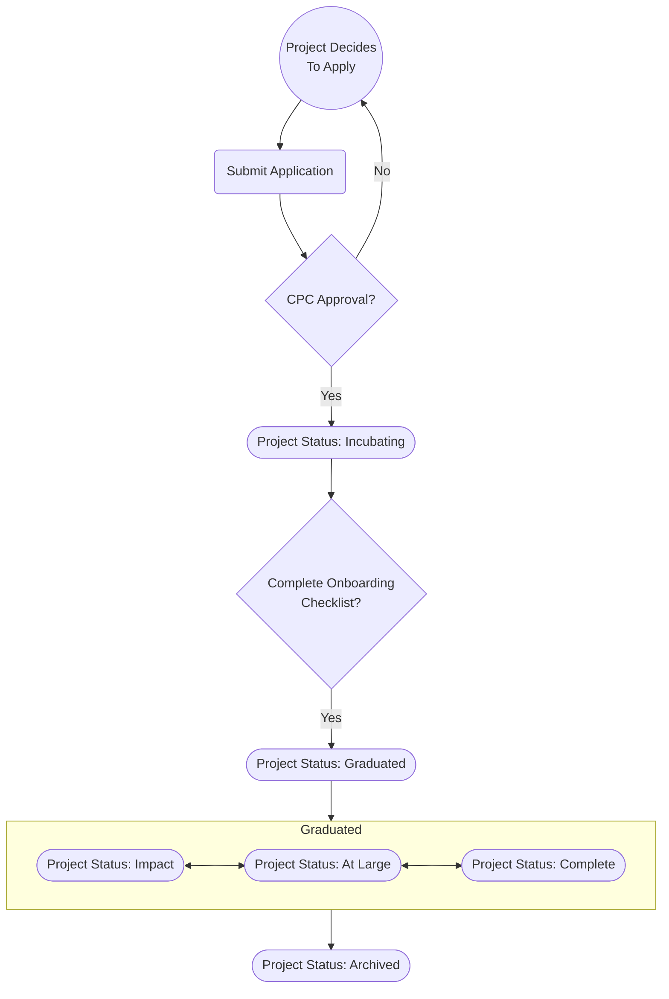

## I. Overview

This governance policy describes how an open source project can formally join the OpenJS Foundation, hereinafter referred to as the "Foundation", via the [Project Proposal Process](#ii-project-proposal-process). It describes the [Stages](#iii-stages---definitions--expectations) a project may be admitted under and what the criteria and expectations are for a given stage, as well as the acceptance criteria for a project to move from one stage to another. It also describes the [Annual Review Process](#vi-annual-review-process) through which those changes will be evaluated and made. 

Project progression - movement from one stage to another - allows projects to participate at the level that is most appropriate for them given where they are in their lifecycle. Regardless of stage, all Foundation projects benefit from a deepened alignment with existing projects, and access to mentorship, support, and foundation resources such as the travel fund.

<!-- For more information about how your project can benefit from Foundation membership and services, please see [TBD Document](). -->

## II. Project Proposal Process

### Introduction

This governance policy sets forth the proposal process for projects to be accepted into the Foundation. The process is the same for both existing projects which seek to move into the Foundation, and new projects to be formed within the Foundation.

### Project Lifecycle

#### Project Stages
| Stage | New Feature Development | Vulnerability & Bug fixes |
|-------|---------------------|--------------|
| Active (At Large/Impact) | ✅ | ✅ | 
| Complete | ❌ | ✅ |
| Archived | ❌ | ❌ |

### Project Proposal Requirements

New projects should express interest to join the OpenJS Foundation via an email to new-projects@lists.openjsf.org with a filled-out [Project Application Template](./NEW_PROJECT_APPLICATION.md). The initial application will have a silent period for internal only discussion. It's worth noting that this is not a commitment to transfer IP, but rather an initial exploration - IP transfer would happen once the project is moved into incubation. If your application is denied during this phase you will be notified privately. If there are no objections to the application, projects will given an `incubation` status and begin the on-boarding process. **Note** the `incubation` status is temporary as we determine if the project is a good fit. At any time during the `incubation` process a project can withdraw either voluntarily or at the request of the CPC.

#### Previous Project Applications

Some projects have decided to publicly share their application after being accepted for incubation. This can be helpful for new applicants to get a sense of what is expected. Please bear in mind, however, that each project is different and that applications will vary accordingly. The CPC considers the resources that each project has available, and the expectations for the application of a large corporate-backed project going for Impact stage will not be the same as those of volunteer maintained effort aiming for the At Large stage.

* [AMP's application](https://gist.github.com/tobie/b5ce633d2622ca4f28e8374d9de8bdf5)
* [Fastify's application](https://gist.github.com/mcollina/beb83b8bc594ae506e11c83aef9c537d)

#### Roles

##### Applicant

Individual or group who submits the application on behalf of a project to join the OpenJS Foundation.

##### Application Manager

The Application Manager ensures progress through the process, helps the project understand the work to be 
completed along with explaining where they are in the application process. Applications Managers can be a
member of the OpenJS Foundation staff, CPC Member, or other person approved by the CPC.

##### Application Champion

The Application Champion is a member of the CPC who commits to do the following:

1. Provide weekly update to the Applicant on progression through the process.
1. Be available to answer questions from the Applicant.
1. Advocate on behalf of the Project applying.
1. Help to explain why the Project is a good fit.
1. Help the Application Manager when needed.
1. Be available as a primary point of contact through the incubation period if reached.

The Application Champion *must not* be the Applicant.

#### Process

1. Initial email sent to new-projects@lists.openjsf.org with filled-out [Project Application Template](./NEW_PROJECT_APPLICATION.md).
1. Silent period. Internal only discussion.
1. Initial acceptance as [Incubating] Project.
1. An acknowledgement is sent to the applicant by Foundation staff within 48 hours (striving to reply within 24 hours when possible).
1. Silent period. Internal only discussion. The content of these discussion along with the content of the application itself are kept confidential.
1. Initial acceptance as an [Incubating] Project. Before public announcement there will be:
   * Private email to the CPC members which asks for +1 or objections to the application becoming public. This email will include:
     * The name of the application manager for the application
     * The name of the application champion for the application
     * Completed application 
     * Completed application-fit checklist.
     * Confirmation that the board has had an FYI and there were no objections.
     * Confirmation that there are no existing objections from CPC members.
     This is not a formal vote just the process to ensure we have regular CPC concensus to move forward.
   * If there is agreement to move forward:
     * Confirmation to the applicant that they are ready to have their application become public.
     * Discussion/agreement between applicant, application manager and Foundation media team to agree on announce date.
       Confirm next steps beyond announcement. 
   * If lack of consensus to move forward:
      * Correspondence from foundation staff to applicant about non-acceptance.
      * If possible, give guidance to the project in their quest to find a foundation home
        (ex. perhaps a different foundation would be a more suitable endeavor.)
   * Discussion/agreement between applicant, application manager and Foundation media team to agree on announce date.
1. Project goes through process of adhering to [on-boarding checklist](#onboarding-checklist).
1. Project completes a charter review process by the CPC as outlined in the [CPC Governance](./governance/GOVERNANCE.md#approving-project-charters). NOTE: this process takes two weeks to complete
1. Project graduates from incubation by a pull request adding the project to the [README.md](./README.md) file at its appropriate initial stage. The merging of this pull request proceeds as any other pull request to the README.md file.

##### Initial fit checklist

1. Is project open/willing to move to open governance?
1. Will project adopt the OpenJS CoC?
1. Licences are compatible with Foundation requirements.
1. What Trade Marks will be transferred
1. What domains will be transferred
1. What IP currently exists and how was it licensed
1. No red flags from website, social media accounts, etc.
1. Confirmation that application is authorized to represent the project.
1. Fit with OpenJS Foundation (not all of these need to be met, but provide different ways of assessing strategic fit).
   1. Impact on JavaScript Community.
   1. How much and how broad is usage within the JavaScript Community.
   1. Level of activity and progress within the project.
   1. Synergy or overlap with existing projects in the Foundation.
   1. Level of comfort that project will be successful. 
  
## Onboarding Checklist

<!--If this checklist is updated please ensure `https://github.com/openjs-foundation/project-status/blob/HEAD/.github/ISSUE_TEMPLATE/00-project-onboarding-checklist-template.md` is updated as well -->

This is an informational checklist to help projects onboard into the OpenJS Foundation - tasks we will complete together after your project has been accepted into the incubation process. If you have any questions or need help, the OpenJS Foundation CPC is available to assist.

- [ ] Adopt the [OpenJS Foundation Code of Conduct](https://code-of-conduct.openjsf.org/)
- [ ] Update project CoC reporting methods to include OpenJS Foundation escalation path
- [ ] List official domains that the project commits to transfer to the OpenJS Foundation following graduation
- [ ] Identify and document other core project infrastructure
- [ ] Adopt either the [Contributor License Agreement (CLA) or the Developer Certificate of Origin (DCO)](https://github.com/openjs-foundation/cross-project-council/blob/HEAD/governance/IP_POLICY_GUIDANCE.md#4-adopting-the-dco-or-a-cla)
- [ ] Add or Update Governance.md document (required for Impact stage)
- [ ] Confirm required files in place (CODE_OF_CONDUCT.md, LICENSE.md)
- [ ] Publish Project Charter on website or GitHub (see [charter template](https://github.com/openjs-foundation/cross-project-council/blob/HEAD/PROJECT_CHARTER_TEMPLATE.md))
- [ ] Update [legal copyright notice](https://github.com/openjs-foundation/cross-project-council/blob/HEAD/governance/IP_POLICY_GUIDANCE.md#2-copyright-notices) on GitHub
- [ ] Add [copyright notices for project website footers](https://github.com/openjs-foundation/artwork#copyright-notices-for-project-website-footers) to project website
- [ ] Add [OpenJS Foundation logo](https://github.com/openjs-foundation/artwork#openjs-foundation-logos) to project website
- [ ] [Add Project logo](https://github.com/openjs-foundation/artwork#preparing-artwork-for-contribution) to OpenJS Foundation website
- [ ] Add Project to the [CPC repo's README.md](https://github.com/openjs-foundation/cross-project-council/blob/HEAD/README.md#incubating-projects) as an Incubating project
- [ ] List trademarks the project commits to transfer to the OpenJS Foundation following graduation
- [ ] If project is using crowdfunding platforms, add disclaimer from the OpenJS Foundation [Trademark Policy](https://trademark-policy.openjsf.org) to platforms
- [ ] Identify individuals from the project to join the CPC [by opening an issue in the CPC repository](https://github.com/openjs-foundation/cross-project-council/issues/new)
- [ ] Document project and foundation contacts for:
  * marketing & social media
  * infrastructure
  * legal/governance help
- [ ] Publish security policy (see [PROJECT_SECURITY_REPORTING](https://github.com/openjs-foundation/cross-project-council/blob/HEAD/PROJECT_SECURITY_REPORTING.md))
- [ ] Work with the foundation to sign a [Project Contribution Agreement](https://docs.google.com/document/d/1Luq5JSUeDPGxj3vyttQvgItHPmj7v39QoKZqpJ9x_sU/edit?usp=sharing) (if needed)
- [ ] Implement an option from the [Github Continuity Policy](./project-resources/github-continuity-policy.md)

## Post-graduation Checklist

<!--If this checklist is updated please ensure `https://github.com/openjs-foundation/project-status/blob/HEAD/.github/ISSUE_TEMPLATE/project-post-graduation-checklist-template.md` is updated as well -->

This is a checklist to help projects complete the post-graduation tasks they committed to during onboarding - tasks we will complete together after your project has graduated from the incubation process. If you have any questions or need help, the OpenJS Foundation CPC is available to assist.

- [ ] Transfer previously indicated official domains to OpenJS Foundation, if any
- [ ] If relevant, implement the appropriate tool to enforce CLA or DCO
- [ ] Transfer previously indicated trademarks to the OpenJS Foundation, if any

## III. Stages - Definitions & Expectations

Every Foundation project has an associated maturity level. Proposed Foundation projects should state their preferred maturity level. Projects of all maturities have access to Foundation resources.

All Foundation projects may attend CPC meetings and contribute work regardless of their stage. 

### At Large Projects

#### Definition

At Large projects are projects which the CPC believes are, or have the potential to be, important to the ecosystem of Top-Level Projects or the JS ecosystem as a whole. They may be early-stage projects just getting started, or they may be long-established projects with minimal resource needs. The At Large stage provides a beneficial, neutral home for these projects in order to foster collaborative development and provide a path to deeper alignment with other Foundation projects via the graduation process.

#### Examples

1. New projects that are designed to extend one or more Foundation projects with functionality or interoperability libraries. 
1. Independent projects that fit the Foundation mission and provide potential for a novel approach to existing functional areas (or are an attempt to meet an unfulfilled need).
1. Projects commissioned or sanctioned by the Foundation.
1. Any project that realistically intends to join the Foundation Incubation or Top Level Stages in the future and wishes to lay the foundations for that transition.

#### Expectations

End users should evaluate At Large projects with care, as this stage does not set requirements for community size, governance, or production readiness. At Large projects will receive minimal marketing support from the Foundation. Projects will be reviewed on an annual basis; they may also request a status review by submitting a report to the CPC.

#### Acceptance Criteria

To be considered for the At Large Stage, the project must meet the following requirements:
* 2 CPC sponsors to champion the project & provide mentorship as needed
* A presentation to at the meeting of the CPC
* Adherence to the Foundation IP Policy
* Upon acceptance, At Large projects must list their status prominently on website/readme

### Impact Stage

#### Definition

The Impact Stage is for projects that have reached their growth goals and are now on a sustaining cycle of development, maintenance, and long-term support. Impact Stage projects are used commonly in enterprise production environments and have large, well-established project communities.
Impact projects offer long-term stability guarantees, and therefore the governing bodies of Impact projects are expected to have representatives from at least three organizations.

#### Examples

1. Projects that have publicly documented release cycles and plans for "Long Term Support" (LTS).
1. Projects that have themselves become platforms for other projects.
1. Projects that are able to attract a healthy number of committers on the basis of its production usefulness (not simply 'developer popularity').
1. Projects that have several, high-profile or well known end-user implementations.

#### Expectations

Impact Stage projects are expected to participate actively in CPC proceedings, and as such have a binding vote on CPC matters requiring a formal vote, such as the election of a CPC Director. They receive ongoing financial and marketing support from the Foundation, and are expected to cross promote the foundation along with their activities. 

#### Acceptance Criteria

To graduate from At Large stage or for a new project to join as an Impact project, a project must meet the following criteria:

 * Demonstrate that it is being used successfully in production by at least two independent end users which, in the CPC’s judgement, are of adequate quality and scope.
 * Have a defined governing body of at least 5 or more members (owners and core maintainers), of which no more than 1/3 is affiliated with the same employer. In the case there are 5 governing members, 2 may be from the same employer. This criterion is to ensure broad representation and to prevent a single organization from having excessive influence on project decision-making.
 * Have a documented and publicly accessible description of the project's governance, decision-making, contribution, and release processes. This is preferably laid out in a GOVERNANCE.md file and references a CONTRIBUTING.md and AUTHORS.md file showing the current and emeritus committers.
 * Demonstrate a substantial ongoing flow of commits and merged contributions.
 * Have a healthy number of committers from at least two organizations. A committer is defined as someone with the commit bit; i.e., someone who can accept contributions to some or all of the project.
 * Adopt the Foundation Code of Conduct.
 * Accept security reports and publicly disclose them after the fix has been made available.
 * Other metrics as defined by the applying Project during the application process in cooperation with the CPC.
 * Obtain approval from the CPC to graduate to Impact stage, following the [decision-making][cpc charter decision making] and [voting][cpc charter voting] policies described in the CPC charter.
    * An issue must be opened in the CPC repo which clearly states the project is being proposed for graduation to Impact stage.
    * The issue must remain open for minimum of 14 days to allow for a sufficient feedback period.
 * Projects can move directly from At Large to Impact, if they can demonstrate sufficient maturity and have met all requirements.

### Incubating

#### Definition

Incubating projects are projects that are in the process of completing their on-boarding checklist to join the foundation. Projects in this phase may be looking to join the foundation as At-Large, Impact, or Complete Stage. Members of incubating projects are invited to join Cross Project Council meetings as a guest, please refer to the [CPC Charter](./CPC-CHARTER.md) for details on how guests may participate in the meetings.

#### Examples

1. Projects that have been accepted into incubation process after silent period.

#### Expectations

It is expected that incubating project will make an active effort to work through the on-boarding process in a reasonable timeframe. They will be offered foundation support to help do so.

#### Acceptance Criteria

1. Consensus within private mailing list to move into incubation process

<!--If this checklist is updated please ensure `https://github.com/openjs-foundation/project-status/blob/HEAD/.github/ISSUE_TEMPLATE/02-project-sunsetting-checklist-template.md` is updated as well -->

### Sunsetting Projects

Projects that are being sunset fall into two statuses: Complete and Archived.

#### Complete

##### Definition

An OpenJS software project is Complete, when the developers responsible for it are no longer providing feature development or enhancements and are solely providing security updates and bug fixes. The software doesn't disappear; it remains functional but is not under active development.

If a Complete project plans to cease security updates and bug fixes it should have a publicly communicated milestone/date, indicating when all activity on the project will cease. Once this date is reached, the project should follow the steps outlined in the Archived project checklist.

##### Acceptance Criteria

Projects may be granted Complete status through CPC consensus and with the approval of the maintainers of the project.

In cases where the project maintainers aren't responding after having been repeatedly contacted through appropriate channels about the CPC's intent to move the project to Complete stage, the CPC may proceed with the stage change to either Complete or Archived without approval from the maintainers.

#### Archived

When an OpenJS project is Archived, it is typically moved to a storage state where the code and resources remain accessible but are no longer actively developed or maintained. Archiving is often done to projects that are obsolete, have been superseded by newer projects, or are no longer viable to maintain.

Archiving is a way of preserving the historical state of a project for reference, educational purposes, or forking by others interested in reviving or branching the project for new purposes.

##### Acceptance Criteria

Projects may be granted Archived status through CPC consensus and with the approval of the maintainers of the project.

In cases where the project maintainers aren't responding after having been repeatedly contacted through appropriate channels about the CPC's intent to move the project to Archived stage, the CPC may proceed with the stage change without approval from the maintainers.

## IV. Growth Plan

At Large project that are interested in reaching Impact Stage need to develop a growth plan to so do. This plan needs to be developed in collaboration with the CPC and approved by it.

Once this growth plan is approved by the CPC, these projects will receive mentorship from the CPC and additional support from the Foundation in order to meet their goals, provided the project stays on track.

A project's progress toward its growth plan goals will be reviewed on a regular basis.

Projects are generally expected to meet their growth plan goals within two years.

## V. Complete Project Checklist

Projects that are transitioning to Complete should follow this checklist. Tasks will be completed together with the CPC and Foundation staff. The goal is to make sure that the Foundation is able to make required changes to the project if the need arises, and revive the project should this become desirable. If you have any questions or need help, the OpenJS Foundation CPC is available to assist.

### Prepare Project For Complete

- [ ] Decide in collaboration with the CPC if the project should go through the Complete phase or be directly moved to Archived
- [ ] Update the README with a prominent notice declaring the project to be "Complete" and what kind of updates the project will continue to receive
- [ ] If all updates to the project are planned to eventually stop, provide a date when this would occur
- [ ] Provide a clear explanation for the decision to cease active developement on the project.
- [ ] Consider creating a separate notice, issue, or blog post for wider visibility.  

### Address Usage

- [ ] If applicable, offer guidance on migrating to alternative projects that provide similar functionality.
- [ ] For critical projects, explore creating a long-term support (LTS) branch  

### Community Communication

- [ ] Notify active contributors and the project community about the decision.
- [ ] If the project is a dependency for other projects, if applicable, consider working with their maintainers to find alternatives or update their dependencies.

### Project Updates

- [ ] Create a list of collaborators/contributors in the repository for historical reference.
- [ ] Address any outstanding issues or pull requests with a closing message explaining the status.
- [ ] Update project website, charter, and README to reflect the Stage
- [ ] Mark project in the CPC repo's README.md as "Complete"
- [ ] Update security policy (see [PROJECT_SECURITY_REPORTING](https://github.com/openjs-foundation/cross-project-council/blob/main/PROJECT_SECURITY_REPORTING.md)) (if applicable)

## VI. Archived Project Checklist

Projects that are transitioning to Archived should follow this checklist. Tasks will be completed together with the CPC and Foundation staff. The goal is to make sure that the Foundation is able to make required changes to the project if the need arises, and revive the project should this become desirable. If you have any questions or need help, the OpenJS Foundation CPC is available to assist.

### Prepare Project For Archiving

- [ ] Decide in collaboration with the CPC whether the project needs to be Archived or whether a call for maintenance is warranted.
- [ ] Ensure all critical issues and pull requests are resolved or properly documented.
- [ ] Before archiving, thoroughly review the repository for any sensitive data such as credentials, API keys, or personal information that should not be publicly archived.
- [ ] Release a final version of the project, if applicable, marking or tagging it clearly as the last official release.

### Community Communication

- [ ] Announce the intention to archive the project well in advance through all available channels, such as the project's mailing list, social media, and GitHub itself.
- [ ] Provide a clear explanation for why the project is being archived and, if possible, recommend alternatives or forks.
- [ ] Open a discussion for community feedback and potential maintainers interested in forking or taking over the project

### Archive Related Materials

- [ ] Ensure all associated documentation, wikis, and websites are updated to reflect the archival status and are stored in a way that remains accessible.
- [ ] Archive any related repositories, such as examples, plugins, or tools developed alongside the main project.

### Finalize Project on GitHub

- [ ] Update project website, charter, and README to reflect Archived Stage
- [ ] Use GitHub's built-in archive feature to make the repository read-only, which prevents new issues, pull requests, and pushes while keeping the project accessible for reference.
- [ ] Update the project's description and website link on GitHub to indicate that it is archived and where to find potential active forks or alternatives.
 - [ ] Move project logo to Archived Stage section
 - [ ] Move project logo on OpenJS Foundation website to Archived Stage section
 - [ ] Mark project in the CPC repo's README.md as Archived
 - [ ] Update security policy (see [PROJECT_SECURITY_REPORTING](https://github.com/openjs-foundation/cross-project-council/blob/main/PROJECT_SECURITY_REPORTING.md))

### Clean Up

- [ ] Confirm all official domains that the project owns have been transferred to the OpenJS Foundation
- [ ] Cancel all cost-incurring infrastructure deployed by the project that is no longer necessary for Archived stage
- [ ] Provide admin access to OpenJS to all infrastructure deployed by the project that isn't canceled
- [ ] Decide on the future of the project's communication channels (e.g., mailing lists, chat rooms). If closing them, provide guidance on where to go for similar projects or communities.

## VII. Annual Review Process

### Annual Foundation Project Health Survey

As part of the yearly rhythm of Foundation and Project communications, the CPC will circulate and collect information from a simple ‘project health survey’ during the month of May  each calendar year. The goals, format, and process for this survey are described below.

#### Annual Project Health Survey Goals

* Foster regular communication between the Foundation, CPC, and participating projects.  
* Maintain an accurate record of key project maintainers' contact information (GitHub handle and email) for all Foundation-participating projects.

#### Annual Project Health Survey Format and Process

* A Project Health Survey Google Form will be created and shared via a GitHub issue in the CPC repository, email to CPC-private group, and posted to Slack. 
* The survey will be published yearly, on or before the fifth of May, with a time-bound window for feedback prior to the end of May
* Projects that do not or are unable to respond by the end of May will be contacted individually to confirm maintainer and operational contacts.
* The Project Health Survey Google Form will include fields to:
   * Verify or update their maintainers' contact information (GitHub handle and email).
   * Raise concerns with the CPC
   * Provide other relevant information
* Responses from the Project Health Survey will be delivered to the Foundation and CPC for consideration, including discussions of Archiving and Complete activities, and proactive support for projects in need.

[Incubating]: #incubating
[cpc charter decision making]: ./CPC-CHARTER.md#section-9-decision-making
[cpc charter voting]: ./CPC-CHARTER.md#section-10-voting
