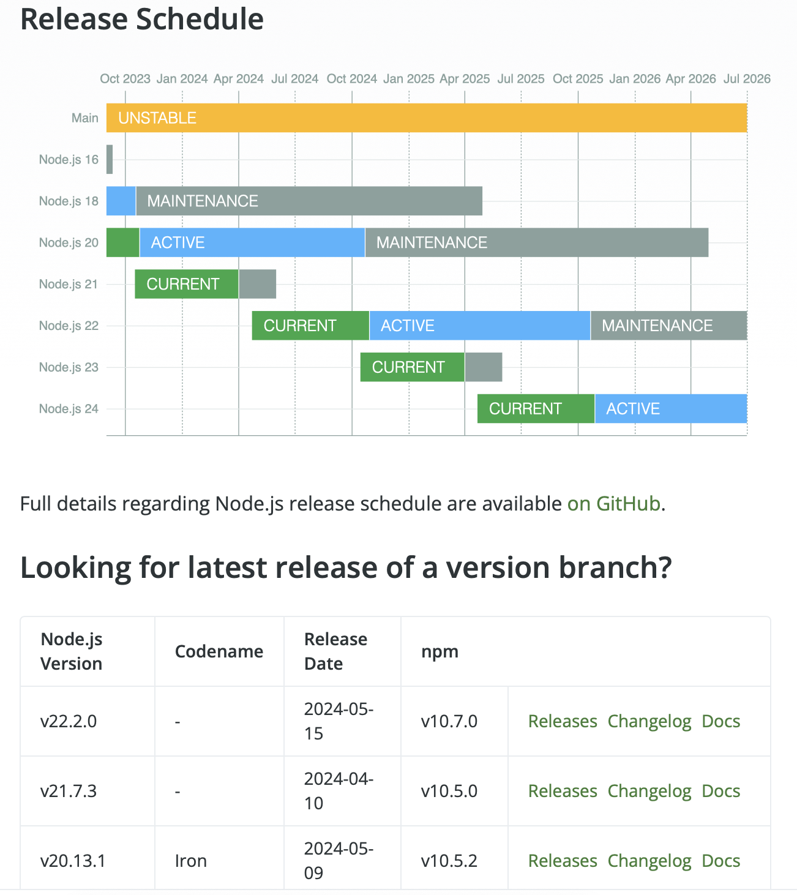
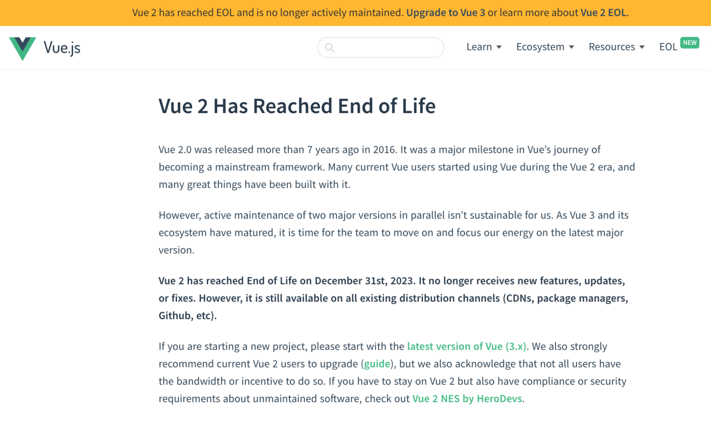
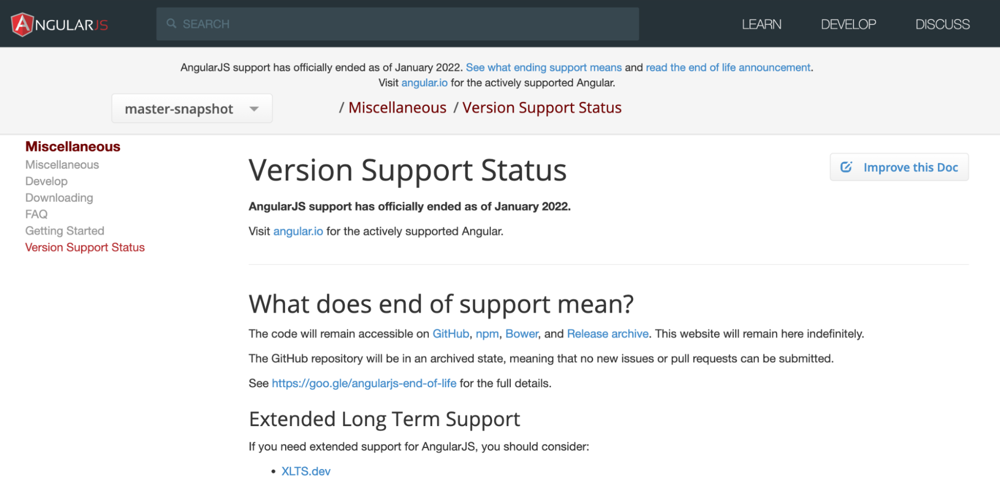

# OpenJS Ecosystem Sustainability Program 

## Summary 

The Ecosystem Sustainability Program is an opt-in OpenJS partner program to help secure outdated software and create new revenue streams for our projects and commercial participants.  

## Benefits

Eligible projects that opt into the program receive revenue that can be used to:

- Grow their community
- Pay contractors
- Support travel
- Cover other project-related expenses

## Current Partners

- [HeroDevs](https://www.herodevs.com/)

## Eligibility

For a project to participate in the program:

- A partner must be providing support to end-of-life (EOL) versions of the project
- The project must be willing to place links to the partner on various pages/repositories where EOL versions are mentioned 
- The project must be willing to manage funds via [Open Collective](https://opencollective.com/).

## How To Participate

Projects that are interested in participating in the program should contact operations@openjsf.org.

## How To Enroll In Open Collective

Because funds are distributed to the project and in most cases not an individual, we suggest creating an *[Open Collective](https://docs.opencollective.com/help/collectives/create-collective)* account and project collective. 

In most cases, projects do not have bank accounts and must [sign up](https://opencollective.com/opensource/apply) with Open Source Collective to be a fiscal host. This means Open Collective will hold the funds on your behalf, handle taxes, and enable you to pay vendors and contractors. 

### Important Information About Payments

- Payments are made to projects every 6 months
- Project payments are excluded from the Linux Foundation General & Administrative (G&A) fee
- Open Collective charges a 10% fee on incoming funds if it is used as a fiscal host. The Open Collective [Docs](https://docs.oscollective.org/how-it-works/fees) provide detailed information on fees.

## General Guidelines

### Version Support Page

The project readme and website should clearly indicate which versions of the project are supported and which are not. Here’s [a great example from the Node.js website](https://nodejs.org/en/about/previous-releases#release-schedule):

### Referral Link Placement & Best Practices

The goal of prominently placing referral links is to maximize the likelihood that a user who is stuck on an unsupported version will learn of the existence of alternatives. This might mean that, prior to an EOL milestone or a major version release, one would temporarily have a prominent banner or link.

- Projects should have a prominent Version Support Page
- Referral links to partners must be placed within the top ⅓ of the page
- The Version Support Page must link to partner pages for the versions our partners support
- When documenting which versions are no longer receiving patches, consider adding a link with copy: “read more about extended support options” that directs to an EOL page.
- Project-specific referral links will be provided as part of the onboarding process.

### Referral Link Page Examples

### End-Of-Life Events

In the 3 to 12 months before a version goes EOL, it would be ideal to add a prominent banner on the entire project's homepage indicating that the version is going EOL, the date upon which it will go EOL, and a link to the Version Support Page.

## Partner Specific Guidelines

### HeroDevs

HeroDevs has offered to directly assist projects by providing specific recommendations and, upon request, utilizing their resources and staff for design and PR filing.
